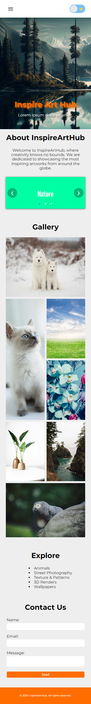
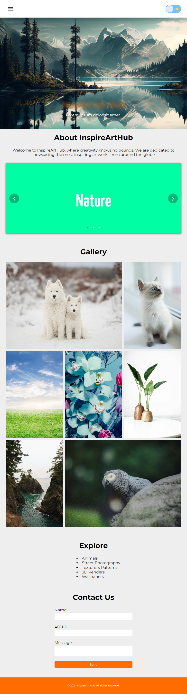

# InspireArtHub

## Module 2 Assignments

This repository contains website with asymmetric grid and dark mode.

See demo [here](https://freedcode.shop)

or

[Netlify](https://freedcode.netlify.app)

Welcome to the InspireArtHub website! This website is dedicated to provide art inspirations and galleries.

## Table of Contents

-   [About](#about)
-   [Gallery](#gallery)
-   [Getting Started](#getting-started)
-   [Preview](#preview)

## About

InspireArtHub... Where creativity knows no bounds. We are dedicated to showcasing the most inspiring artworks from around the globe.

## Features

-   **Gallery Exploration**: Explore a picture of art and wallpapers.
-   **Contact Us**: Reach out to us for inquiries, feedback, or collaborations.

## Getting Started

To get started with the Revotify website, simply clone this repository to your local machine and open the `index.html` file in your web browser.

```bash
git clone https://github.com/RevoU-FSSE-4/module-2-iyefreedy.git
cd module-2-iyefreedy
```

## Preview

Mobile



Desktop


