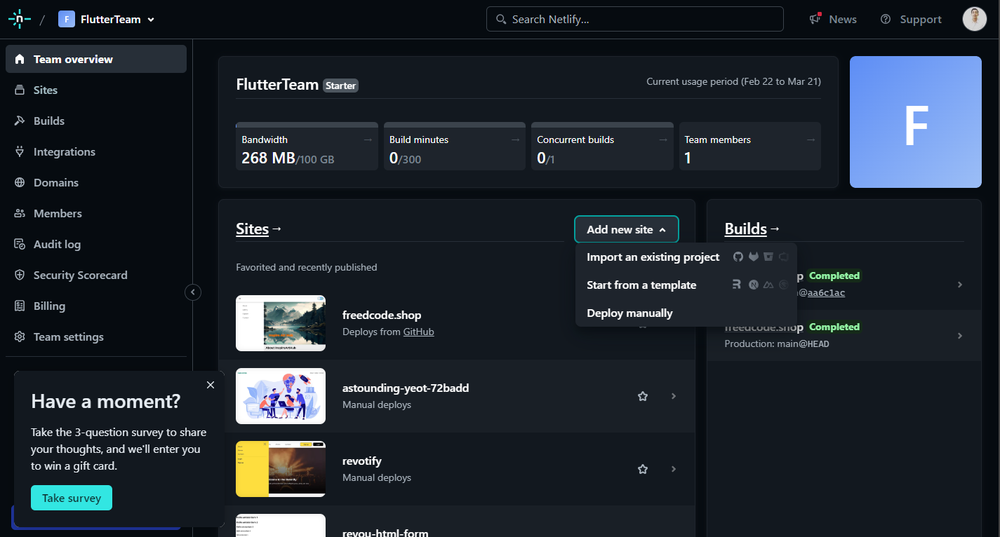

# InspireArtHub

## Module 2 Assignments

This repository contains website with asymmetric grid and dark mode.

See demo [here](https://freedcode.shop)

or

[Netlify](https://freedcode.netlify.app)

Welcome to the InspireArtHub website! This website is dedicated to provide art inspirations and galleries.

## Table of Contents

-   [About](#about)
-   [Gallery](#gallery)
-   [Getting Started](#getting-started)
-   [Deploying](#deploying)
-   [Preview](#preview)

## About

InspireArtHub... Where creativity knows no bounds. We are dedicated to showcasing the most inspiring artworks from around the globe.

## Features

-   **Gallery Exploration**: Explore a picture of art and wallpapers.
-   **Contact Us**: Reach out to us for inquiries, feedback, or collaborations.

## Getting Started

To get started with the Revotify website, simply clone this repository to your local machine and open the `index.html` file in your web browser.

```bash
git clone https://github.com/RevoU-FSSE-4/module-2-iyefreedy.git
cd module-2-iyefreedy
```

## Deploying

1. Login to netlify

2. Click **add new site** and select **import from existing project**



3. Choose **deploy with github** and you will be redirect to github then authorize your github account


4. Select repository you want to deploy


5. Fill form configuration and choose branch


6. After filling form configuration you will be redirected to your new site and wait until deployment process by netlify is done


7. Then choose **set up a custom domain**

8. Add domain you have


9. After adding domain, you will be redirected to domain management and see the warning. Click on it and it will pop out an information to change your nameserver domain


10. Go to domain provider and click **Domains** menu

11. Click **manage** on domain you want to use

12. Replace the default **nameservers** with netlify nameservers

## Preview

Mobile


Desktop


